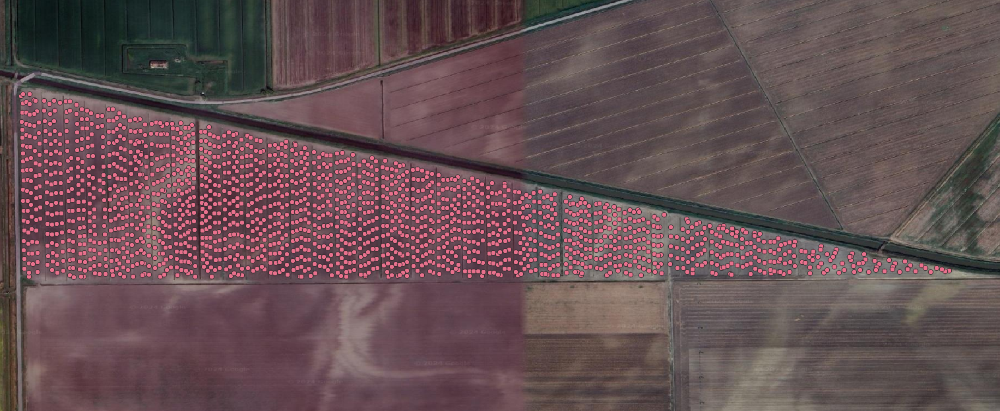
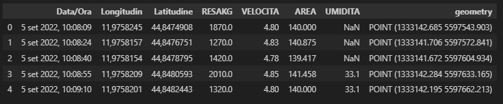
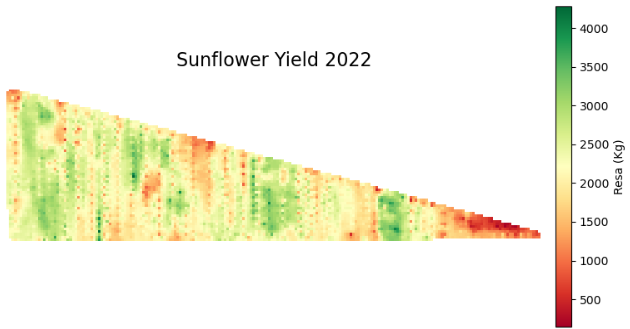
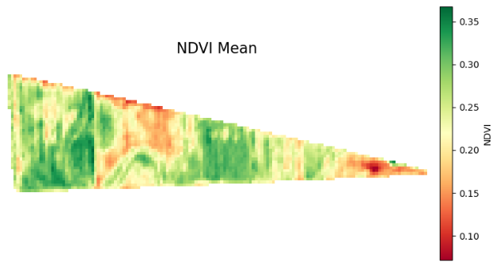
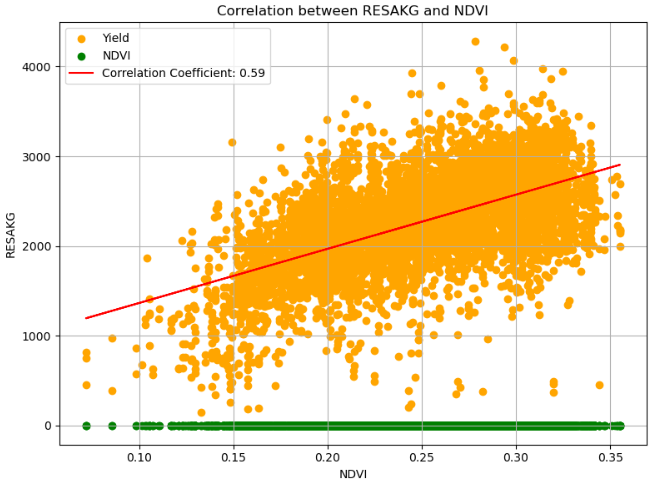
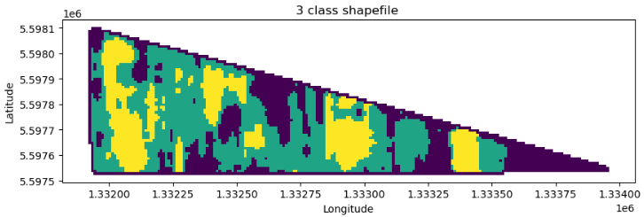

# Sunflower-Harvest-NDVI-Correlation-Analysis
Generate spatially interpolated data (IDW) of a series of parameters analyzed in field (e.g. Yield), and correlate them with the average Normalized Difference Vegetation Index (NDVI) over the previous year

## Key Features and Components:

The input data is a geopackage file representing a set of points. Each point has a series of characteristics, such as: georeferenced coordinates (Longitudine, Latitudine), product weight (RESAKG), harvester speed (VELOCITA), harvested area (AREA), and product humidity (UMIDITA).    

Visual rappresentation of the points:  

### Data Cleansing and Preparation: 
The repository includes scripts and guidelines for preprocessing raw yield data.   
This involves handling missing values, remove duplicates and other operations. 
Steps for cleaning and formatting data ensure accuracy and consistency for subsequent analyses.  
An exploration of key underlying statistics is also done.

The first lines of the geopackage::

### Spatial Interpolation and data collection (RED and NIR): 
Spatial interpolation techniques are implemented to interpolate yield data across the field.   
Algorithms such as Inverse Distance Weighting (IDW) are utilized to generate continuous yield maps from discrete data points.  
Explanations and implementations of these algorithms are provided, along with examples of input data formats and output data formats (raster maps).

Spatially interpolated data (Yield):

To perform a correlation it was necessary to obtain the average NDVI data. In particular, in this code it is used the APIs provided by Copernicus Data Space Ecosystem.

To calculate the average NDVI, the images in the bands of interest (RED and NIR, B04 and B08 bands) were collected in the period in which it was assumed there was cultivation in the field.   
Subsequently, the values ​​were averaged through raster calculations and the NDVI was calculated with the classic formula:  

$NDVI=\frac{NIR−RED}{NIR+RED}\$

NDVI mean resulted from collected data:

### Correlation with NDVI: 
Harvested yield and humidity are correlated with NDVI (Normalized Difference Vegetation Index) calculated over the sunflower coltivation year (march-september) for the same field.  
In particular, the code calculates Pearson's linear correlation coefficient. 
This correlation provides information on how yield changes relate to vegetation health indicators.  

The results of the work showed a moderate correlation between the yield and the average NDVI value (Pearson correlation coefficient of 0.59). 
This tells us that the two variables tend to move in a similar way, when one variable increases, the other also tends to increase.  

Plot of the Pearson's linear correlation between yield and the average NDVI:

### Extra: Generate a vector file for field application
Once the interpolated yield or vigor data are obtained, it is possible to convert this information into vector format for the application of precision farming operations.  
In this case the input raster (Yield interpolated) was filtered to perform smoothing operation on the input data. 
Then, it was divided in homogeneous areas, in particular by dividing the area into 3 classes (in quantiles 0.25, 0.75, 1). 
For each homogeneous area identified, a specific program could be established (e.g. differentiated fertilization).  

